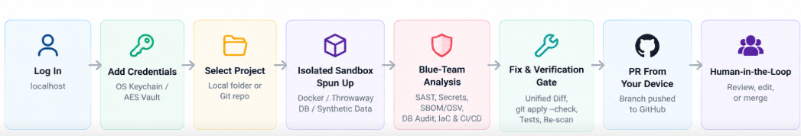

<div align="center">

 # Zerra: A Local-First, Blue-Team Security Platform

**Your security engineer, running on your own machine. It tests everything locally, fixes what it finds, and sends the fixes to GitHub as pull requests.**

[](https://github.com/sjsreehari/zerra/actions/workflows/ci.yml)
[](LICENSE)
[](compose.yaml)
[](https://nodejs.org)
[](https://python.org)
[](https://golang.org)
[](https://github.com/sjsreehari/zerra/issues)
[](CONTRIBUTING.md)

*Local-first · Self-hosted · Blue-team defense · Automated verification & PRs*

</div>

---

## Overview

**Zerra** is an open-source, local-first blue-team security platform with a local web dashboard. You log in on `localhost`, add your credentials once to an encrypted local vault, and point Zerra at a project folder or repository.

Zerra then clones, builds, executes, and verifies tests **entirely on your device** inside isolated sandboxes. When it finds a security vulnerability or misconfiguration, it generates and proves a fix inside the sandbox, checks for regressions, commits the fix to a new branch, and opens a GitHub Pull Request from your machine for you to review.

> **Nothing is pushed directly to your main branch, and your code, databases, and credentials never leave your machine.**

---

## How It Works




1. **Log in** to your local dashboard running on `http://localhost:3000`.
2. **Add credentials** on the Credentials page: GitHub access (fine-grained Personal Access Token or SSH deploy key), database connection strings, API keys, and `.env` values. These are stored in your encrypted local vault (OS keychain with an authenticated AES-256-GCM fallback).
3. **Add a project** by selecting a local folder or specifying a GitHub repository to clone locally.
4. **Zerra builds a sandbox:** it provisions the app, a throwaway copy of the database, and any dependent services in Docker, seeding them with synthetic or masked data instead of production data.
5. **It analyzes and tests everything:** SAST, hardcoded secrets, dependency supply chains, database configurations, and infrastructure configs.
6. **It fixes and verifies each issue:** AI-synthesized patches are tested inside the sandbox against your actual test suite, linter, and scanner.
7. **It opens a PR from your device:** Zerra creates a branch locally, commits the verified patch, and opens a GitHub Pull Request with full context, evidence, and verification logs.
8. **You review and merge:** Review the PR just like any teammate's contribution.

---

## What It Does

### 1. Code Security Review
- **Static Application Security Testing (SAST):** Powered by Semgrep and custom security rules for SQL injection, Cross-Site Scripting (XSS), Command Injection, Server-Side Request Forgery (SSRF), Path Traversal, Insecure Deserialization, Broken Cryptography, Broken Access Control, and Unsafe Redirects.
- **Diff-scoped and full-repo scans:** Rapid incremental scans on PRs or changed files, plus comprehensive baseline scans on demand or on a schedule.
- **Vulnerability intelligence:** CWE and OWASP Top 10 mapping, severity scoring (CRITICAL, HIGH, MEDIUM, LOW), and clear explanations.

### 2. Secrets and Credentials
- **Entropy & pattern detection:** Scans code, configs, and environment files for high-entropy strings, API keys, private keys, cloud tokens, and passwords.
- **Git history exploration:** Analyzes historical commits to detect accidentally committed and deleted credentials.
- **Smart allowlisting:** Automatically ignores UUIDs, cryptographic hashes, base64 fixtures, and test mocks to minimize noise.
- **Automated remediation:** Migrates secrets to environment variables, updates `.gitignore`, and files an issue with rotation steps.

### 3. Dependencies and Supply Chain
- **SBOM generation & CVE lookups:** Uses Syft to build Software Bills of Materials and queries the OSV vulnerability database across `package.json`, `requirements.txt`, `go.mod`, `pom.xml`, and `Cargo.toml`.
- **Safe version upgrades:** Automatically prepares dependency upgrade PRs bumped to the nearest non-vulnerable version, verified by running your test suite in the sandbox.
- **Supply chain risk:** Typosquatting detection, unmaintained package alerts, and license compliance audits.

### 4. Local Database Security
- **Configuration audits:** Audits local and dev instances of PostgreSQL, MySQL, MongoDB, Redis, and SQLite for default passwords, missing authentication, exposed network ports, and unencrypted connections.
- **Schema & migration reviews:** Detects plaintext password columns, missing foreign key constraints, and unconfigured Row-Level Security (RLS) rules.
- **Query safety verification:** Traces untrusted user inputs into SQL statements and tests parameterized query fixes inside the sandbox database.

### 5. Simulated Environments (Sandboxes)
- **Isolated Docker environments:** Spun up on-demand from existing `Dockerfile` and `docker-compose.yml` configurations.
- **Throwaway databases:** Seeded with synthetic, randomized mock data—never touching real production data.
- **Test suite validation:** Executes your unit and integration tests inside the sandbox to prove fixes cause zero regressions.
- **Network isolation:** Sandboxes run with zero external internet access by default, preventing data leakage.
- **Clean teardown:** All containers, volumes, and temporary networks are completely destroyed after each run.

### 6. Infrastructure and Configuration
- **Infrastructure-as-Code (IaC) scanning:** Checks Dockerfiles, Compose files, Terraform templates, and Kubernetes manifests for misconfigurations and security risks.
- **CI/CD pipeline review:** Scans GitHub Actions workflows for unpinned third-party actions, excessive permissions (`write-all`), and script injection risks.
- **Configuration hygiene:** Flags exposed `.env` files, missing required secrets, insecure defaults, and weak cookie attributes (missing `HttpOnly`, `SameSite`, `Secure`).

### 7. Automated Fixing
- **Confidence-scored patches:** Generates minimal, surgical unified diffs with a confidence score. High-confidence fixes become PRs; uncertain items become GitHub Issues with actionable recommendations.
- **Strict verification gate:** Every patch must be a valid unified diff, pass `git apply --check`, pass linting and the test suite, and eliminate the vulnerability on a re-scan.
- **Local LLM support:** Connects to local inference engines (such as Ollama or vLLM) so proprietary code and diffs never leave your workstation.
- **Automatic rollback:** Any patch that breaks a test or fails to resolve the finding is immediately discarded.

### 8. Proactive Hardening
- **HTTP defense:** Recommends and configures Content Security Policy (CSP), HSTS, anti-clickjacking headers, and CORS rules.
- **Container security:** Hardens Dockerfiles to use non-root users, minimal scratch/distroless base images, and immutable digest pinning.
- **Repository hygiene:** Generates `SECURITY.md`, secret-safe `.gitignore` rules, Dependabot/Renovate configurations, and branch protection policies.

### 9. Device-Originated Pull Requests
- **Pushed from your machine:** Branches are created locally on your machine and pushed using your configured local credentials.
- **Rich PR documentation:** Pull requests include the security finding, reproduction evidence, unified diff, and sandbox verification logs.
- **No main pushes:** Zerra never commits to or force-pushes to your default branch. You retain full review and merge authority.

### 10. Policy and Governance
- **Policy-as-code (`.zerra.yml`):** Define severity failure thresholds, ignored rules, auto-fix permissions, and sandbox timeouts.
- **SARIF export:** Full OASIS SARIF output compatible with GitHub Code Scanning, SonarQube, and DefectDojo.
- **Tamper-evident audit trail:** Comprehensive local logs detailing every scan, finding, test run, and fix decision.

### 11. Interactive Dashboard
- **Web interface:** Modern Next.js interface on `http://localhost:3000` with dark mode support.
- **Credential vault:** Manage scoped GitHub tokens, SSH keys, database credentials, and LLM endpoints securely.
- **Live scan & SARIF explorer:** Inspect active scans, filter by severity, view syntax-highlighted code snippets, and mark false positives.
- **Sandbox logs & metrics:** Live streaming output from Docker sandbox runs and patch verification checks.

### 12. Trust and Privacy
- **Local-first guarantee:** Code, databases, logs, and credentials remain on your device.
- **Zero-knowledge vault:** Secrets are encrypted with the host OS keychain (`keytar`) or AES-256-GCM authenticated encryption.
- **Offline operation:** Functions without an internet connection using local Semgrep rules, local Syft databases, and local LLMs.
- **Human-in-the-loop:** You review, test, and merge every single change.

---

## Security Model: Credential Protection

Because Zerra operates as a blue-team security tool with access to repository code and sandbox environments, it adheres to strict credential security principles:

1. **Least-Privilege GitHub Access:**
   - **Recommended:** Fine-grained Personal Access Tokens (PATs) scoped strictly to target repositories with minimal permissions (`Contents: Read & Write`, `Pull Requests: Read & Write`, `Issues: Read & Write`).
   - **Alternative:** SSH Deploy Keys restricted to specific repositories.
   - **Never required:** Classic personal access tokens with broad account-level or organization-wide permissions.

2. **Local Credential Storage Architecture:**
   - **Primary:** Operating System Keychain (Windows Credential Manager, macOS Keychain, Linux Secret Service / libsecret via `keytar`).
   - **Fallback:** AES-256-GCM authenticated encryption with keys derived using `scrypt` (salt + IV + 128-bit authentication tag), saved to a file restricted to user-only permissions (`0o600`).
   - **Zero telemetry:** Credentials are never transmitted to external telemetry, cloud services, or remote analytics endpoints.

3. **Sandbox Network Isolation:**
   - Sandbox containers run on private internal bridge networks with outbound access disabled by default, preventing untrusted dependencies from exfiltrating credentials.

---

## Architecture

> 📖 **Deep Dive:** For the complete system design, Mermaid state charts, layer-by-layer specs, and threat model, see [docs/ARCHITECTURE.md](docs/ARCHITECTURE.md).

```
┌────────────────────────────────────────────────────────────────────────┐
│                        Local Machine (Your Device)                     │
│                                                                        │
│   ┌────────────────────────┐          ┌───────────────────────────┐    │
│   │   Next.js Dashboard    │ ◄──────► │    Credential Vault       │    │
│   │ (http://localhost:3000)│          │ (OS Keychain/AES-256-GCM) │    │
│   └───────────┬────────────┘          └─────────────┬─────────────┘    │
│               │ API Calls                           │ Credentials      │
│               ▼                                     ▼                  │
│   ┌───────────────────────────────────────────────────────────────┐    │
│   │              Zerra Engine & Orchestrator                      │    │
│   │        (FastAPI / LangGraph / Go Worker Services)             │    │
│   └───────┬───────────────────────────────────────────────┬───────┘    │
│           │                                               │            │
│           ▼                                               ▼            │
│   ┌───────────────────────────┐         ┌──────────────────────────┐   │
│   │   Blue-Team Scanners      │         │   Fix Engine & LLM       │   │
│   │ • Semgrep (SAST)          │         │ • Unified diff generator │   │
│   │ • Syft + OSV (SCA)        │         │ • Local LLM (Ollama) or  │   │
│   │ • Secret Detector         │         │   Anthropic API          │   │
│   │ • DB & IaC Configuration  │         │ • Confidence gate        │   │
│   └─────────────┬─────────────┘         └─────────────┬────────────┘   │
│                 │ Findings                            │ Proposed Patch │
│                 └──────────────┬──────────────────────┘                │
│                                ▼                                       │
│   ┌───────────────────────────────────────────────────────────────┐    │
│   │                  Isolated Docker Sandbox                      │    │
│   │ • Disposable app container & throwaway database               │    │
│   │ • Synthetic mock datasets (never real data)                   │    │
│   │ • Verification: git apply --check -> npm test -> re-scan      │    │
│   └───────────────────────────┬───────────────────────────────────┘    │
│                               │ Verified Clean Patch                   │
│                               ▼                                        │
│   ┌───────────────────────────────────────────────────────────────┐    │
│   │                     Local Git Subsystem                       │    │
│   │ • Create feature branch: fix/zerra-<finding-id>               │    │
│   │ • Commit verified patch with evidence & test summary          │    │
│   └───────────────────────────┬───────────────────────────────────┘    │
└───────────────────────────────┼────────────────────────────────────────┘
                                │ Push Branch & Open PR
                                ▼
                   ┌──────────────────────────┐
                   │    GitHub Repository     │
                   │ (Pull Request for Review)│
                   └──────────────────────────┘
```

---

## What is Built vs. What is Next

### What is Currently Built

| Component | Status | Location / Implementation Details |
|---|:---:|---|
| **Encrypted Credential Vault** | Done | [cli/src/secrets.ts](cli/src/secrets.ts) — OS Keychain integration via `keytar` with AES-256-GCM and `scrypt` fallback (`0o600`). |
| **Fix Verification Engine** | Done | [packages/fix-engine/src/index.ts](packages/fix-engine/src/index.ts) — Diff parsing, `git apply --check`, test detection (`npm test`, `make test`), offline test execution, and re-scan gate. |
| **Scanner Worker** | Done | [packages/scanner/](packages/scanner/) & [backend/cmd/scanner/](backend/cmd/scanner/) — Semgrep SAST execution, Syft SBOM generation, OSV batch querying, and entropy-based secret scanning. |
| **Local Dashboard** | Done | [frontend/](frontend/) — Next.js 15 dashboard with routes for Findings, Repositories, Scans, Threat logs, Policies, and Settings. |
| **Docker Compose Stack** | Done | [compose.yaml](compose.yaml) — Services for Postgres 16, Gateway, Agent Inference, and Dashboard. |
| **LangGraph Agent & Inference** | Done | [agent/](agent/) — Python 3.11 agent with LangGraph orchestration, attack simulation, and Ollama local LLM integration. |
| **Prisma Schema & Contracts** | Done | [packages/schema/](packages/schema/) — Shared database models, scan types, and OpenAPI specifications. |

### What is Next

| Milestone | Target | Description |
|---|:---:|---|
| **Direct Project Import & Local Repo Selector** | Priority 1 | Allow users to select any local path directly from the web dashboard or CLI to initiate immediate scans. |
| **Interactive SARIF Viewer & False-Positive Triage** | Priority 1 | Inline code jumping and false-positive dismissal directly from the findings view ([#35](https://github.com/sjsreehari/zerra/issues/35), [#36](https://github.com/sjsreehari/zerra/issues/36)). |
| **Local Database Sandbox Integrations** | Priority 2 | Automated provisioning of throwaway Postgres, MySQL, MongoDB, and Redis containers seeded with synthetic data. |
| **Full Baseline Repo Scans** | Priority 2 | Trigger full-codebase baseline reviews independently of pull requests ([#37](https://github.com/sjsreehari/zerra/issues/37)). |
| **Desktop CLI Onboarding Improvements** | Priority 3 | Interactive terminal setup for credentials and project configuration via `zerra init`. |
| **Alert Webhooks (Slack / Discord)** | Priority 3 | Webhook delivery for critical security alerts ([#33](https://github.com/sjsreehari/zerra/issues/33)). |

---

## Tech Stack

- **Dashboard:** Next.js 15, React 19, TypeScript, TailwindCSS
- **Scanner Engine:** Go 1.22, Semgrep CLI, Syft, OSV API
- **AI Agent & Inference:** Python 3.11, FastAPI, LangGraph, Ollama
- **Fix Engine & CLI:** Node.js 18+, TypeScript, Commander, Keytar, Node Crypto
- **Database & Storage:** PostgreSQL 16, Prisma ORM, Redis
- **Containerization:** Docker & Docker Compose

---

## Quickstart

### Prerequisites

- **Docker Desktop** (macOS, Windows) or Docker Engine + Docker Compose (Linux)
- **Node.js 18+** & **npm**
- **Git**

### 1. Clone & Start Zerra

```bash
git clone https://github.com/sjsreehari/zerra.git
cd zerra
cp .env.example .env
npm install
docker compose up -d --build
```

### 2. Access the Dashboard

Open your browser and navigate to:

```
http://localhost:3000
```

### 3. Add Credentials

1. Go to **Settings > Credentials** in the dashboard.
2. Add your **GitHub Personal Access Token** (fine-grained, scoped to target repositories with `Pull requests: write` and `Contents: write`).
3. (Optional) Provide your local Ollama endpoint (`http://localhost:11434`) or API key.
4. All credentials are encrypted and stored in your device's keychain.

### 4. Scan a Project

Select a local folder or provide a Git repository URL. Zerra builds an isolated container, scans the codebase, verifies fixes in the sandbox, and opens a GitHub Pull Request from your machine.

---

## Development

### Monorepo Workspaces

```bash
# Install all dependencies across workspaces
npm install

# Generate Prisma client
npm run prisma:generate

# Run tests across packages
npm test
```

### Running Individual Services

```bash
# Frontend (Next.js Dashboard)
npm run dev --workspace=frontend

# Go Backend
cd backend && go run ./cmd/api.go

# Python AI Agent
cd agent
python -m venv venv
source venv/bin/activate    # Windows: .\venv\Scripts\Activate.ps1
pip install -r requirements.txt
uvicorn api:app --reload --port 8000
```

### Testing

```bash
# Run unit & workspace tests
npm run test:unit

# Run Go scanner tests
cd backend && go test ./...

# Run Python agent tests
cd agent && pytest tests/ -v
```

---

## Contributing

We welcome contributions! Whether you are adding Semgrep detection rules, improving sandbox integrations, or polishing the dashboard:

1. Read our [CONTRIBUTING.md](CONTRIBUTING.md) guide.
2. Adhere to our [CODE_OF_CONDUCT.md](CODE_OF_CONDUCT.md).
3. Check out issues tagged [`good first issue`](https://github.com/sjsreehari/zerra/labels/good%20first%20issue) or [`help wanted`](https://github.com/sjsreehari/zerra/labels/help%20wanted).

---

## Security & Responsible Disclosure

Zerra is an application security platform, and we hold our own codebase to the highest standard.

If you discover a security vulnerability in Zerra, please do not file a public issue. Follow our responsible disclosure process detailed in [SECURITY.md](SECURITY.md) or email **isrosreehari@gmail.com**.

---

## License

Zerra is distributed under the **GNU General Public License v3.0**. See [LICENSE](LICENSE) for details.

---

<div align="center">

*Zerra — Local-first security engineering for modern software teams.*

[GitHub](https://github.com/sjsreehari/zerra) · [Issues](https://github.com/sjsreehari/zerra/issues) · [Discussions](https://github.com/sjsreehari/zerra/discussions)

</div>
