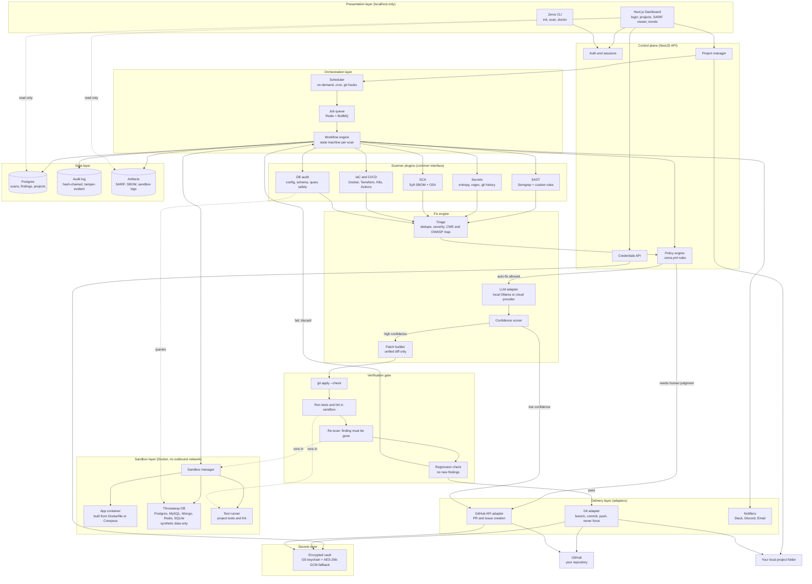
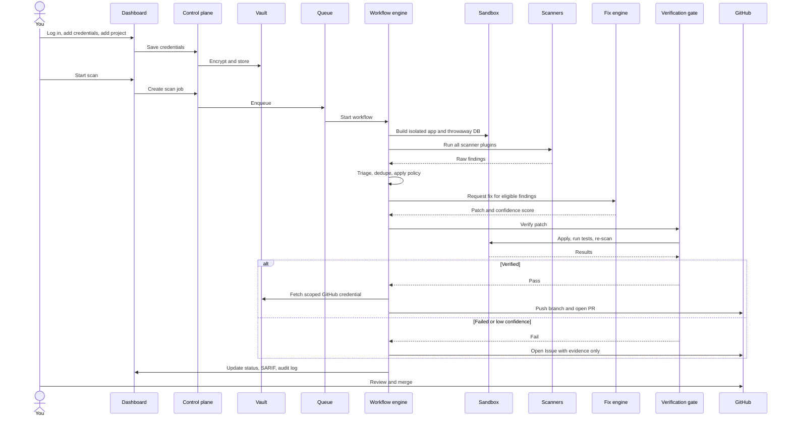
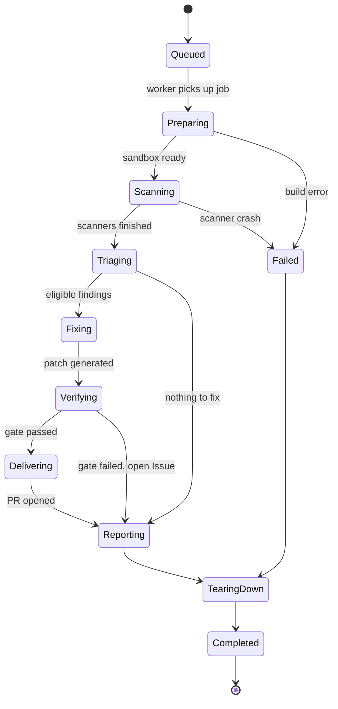
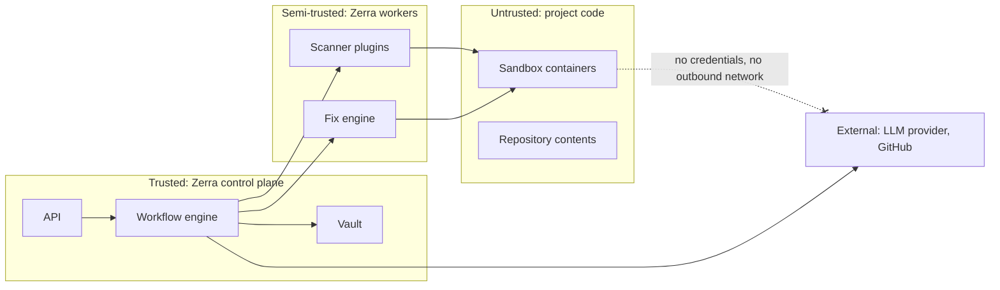
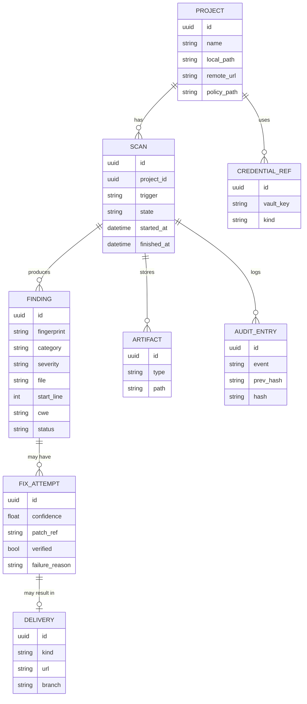

# Zerra Architecture

> **Status:** Design Document. Parts of this describe the target architecture; see [Implementation Status](#12-implementation-status) for what exists today.

Zerra is a self-hosted, local-first, blue-team security platform. You log in to a local dashboard, add credentials once, and point Zerra at a project. It builds the project in isolated sandboxes on your own machine, tests code, dependencies, configuration, and databases, fixes what it finds, verifies each fix, and opens a pull request from your device to GitHub for you to review.

---

## Table of Contents

- [1. Goals and Non-Goals](#1-goals-and-non-goals)
- [2. Design Principles](#2-design-principles)
- [3. Patterns We Borrow](#3-patterns-we-borrow)
- [4. System Overview](#4-system-overview)
- [5. Layer-by-Layer](#5-layer-by-layer)
  - [5.1 Presentation Layer](#51-presentation-layer)
  - [5.2 Control Plane](#52-control-plane)
  - [5.3 Secrets Layer](#53-secrets-layer)
  - [5.4 Orchestration Layer](#54-orchestration-layer)
  - [5.5 Sandbox Layer](#55-sandbox-layer)
  - [5.6 Scanner Plugins](#56-scanner-plugins)
  - [5.7 Fix Engine](#57-fix-engine)
  - [5.8 Verification Gate](#58-verification-gate)
  - [5.9 Delivery Layer](#59-delivery-layer)
  - [5.10 Data Layer](#510-data-layer)
- [6. Scan Lifecycle](#6-scan-lifecycle)
  - [6.1 Sequence Flow](#61-sequence-flow)
  - [6.2 Scan State Machine](#62-scan-state-machine)
- [7. Core Contracts](#7-core-contracts)
  - [7.1 Scanner Plugin Interface](#71-scanner-plugin-interface)
  - [7.2 Normalized Finding](#72-normalized-finding)
  - [7.3 Adapter Ports](#73-adapter-ports)
  - [7.4 Policy File (`.zerra.yml`)](#74-policy-file-zerrayml)
- [8. Security Model](#8-security-model)
  - [8.1 Trust Boundaries](#81-trust-boundaries)
  - [8.2 Threat Model](#82-threat-model)
  - [8.3 Credential Recommendations](#83-credential-recommendations)
- [9. Data Model](#9-data-model)
- [10. Repository Mapping](#10-repository-mapping)
- [11. Extending Zerra](#11-extending-zerra)
- [12. Implementation Status](#12-implementation-status)
- [13. Key Decisions](#13-key-decisions)

---

## 1. Goals and Non-Goals

### Goals
- **Local-first:** Code, databases, and credentials stay on the user's machine.
- **Blue team only:** Find, fix, harden, and prove. No offensive tooling.
- **Verified fixes:** No change reaches GitHub unless it applies, passes tests, and survives a re-scan.
- **Human in the loop:** Every change arrives as a PR or Issue. Nothing is pushed to the default branch.
- **Extensible:** New scanners, LLM providers, and Git hosts are plugins or adapters.
- **Self-hostable and open source.**

### Non-Goals
- Red team attack simulation, exploitation, or DAST against production systems.
- A hosted SaaS that receives user code.
- Auto-merging changes without human approval.
- Replacing a full SIEM or runtime protection product.

---

## 2. Design Principles

| Principle | What it means in practice |
|---|---|
| **Nothing is trusted until verified** | A patch can reach GitHub only through the verification gate. |
| **Isolation by default** | Scanners and tests run in disposable containers with no outbound network. |
| **Least privilege** | Credentials are fetched at the moment of use, scoped to one repo, and never enter a sandbox. |
| **Everything is replaceable** | Scanners, LLMs, and Git hosts sit behind interfaces. |
| **Reproducible and auditable** | Every scan is a state machine with recorded transitions and a hash-chained audit log. |
| **Fail closed** | If verification is uncertain, the result is an Issue, not a PR. |

---

## 3. Patterns We Borrow

| Pattern | Origin | How Zerra uses it |
|---|---|---|
| **Hexagonal (ports and adapters)** | Clean architecture | Core logic never touches Git, GitHub, Docker, or an LLM directly. |
| **Pipes and filters** | CI/CD systems, Semgrep, Trivy | A scan is a pipeline: detect, triage, fix, verify, deliver. |
| **Plugin architecture** | Semgrep, SonarQube, Trivy | Every scanner implements one common interface. |
| **Event-driven job queue** | BullMQ, Temporal workflows | Long scans run in the background and can be retried. |
| **Sandbox isolation** | Docker, gVisor, CI runners | Every test runs in a disposable, network-isolated container. |
| **Policy as code** | OPA, Kyverno | `.zerra.yml` decides what blocks, auto-fixes, or becomes an Issue. |
| **Human-in-the-loop gate** | Dependabot, Renovate | Changes arrive as PRs you approve. |
| **Zero-trust secrets** | HashiCorp Vault, OS keychains | Encrypted vault, short-lived scoped credentials. |
| **CQRS-lite** | Event sourcing systems | Writes go through the job pipeline; the dashboard only reads. |

---

## 4. System Overview



---

## 5. Layer-by-Layer

### 5.1 Presentation Layer
The Next.js dashboard and the CLI are the only user-facing surfaces. Both bind strictly to `localhost` and communicate exclusively with the control plane.
- **Dashboard:** Login, credentials vault, project management, live scan status, interactive SARIF viewer (filter by severity, jump to file and line, mark false positives), sandbox logs, and security trend charts.
- **CLI:** `zerra init`, `zerra scan`, and `zerra doctor` for headless, scripted, or CI-local use.

### 5.2 Control Plane
A NestJS API that handles authentication, project configuration, credentials metadata, and policy enforcement. It never executes scans directly in-process; it only dispatches jobs to Redis/BullMQ. This maintains responsiveness and isolates untrusted analysis from session-handling processes.

### 5.3 Secrets Layer
The vault is the only component that stores credentials (GitHub PATs or SSH keys, database connection strings, API keys, `.env` values).
- **Primary storage:** Operating system keychain via `keytar`.
- **Fallback:** Authenticated `AES-256-GCM` encryption with key derivation via `scrypt` and file permissions restricted to `0o600`.
- **Delivery:** Delivery adapters request credentials at the exact moment of use. Sandboxes never receive credentials.
- **Redaction:** Secrets are sanitized and stripped from logs, SARIF outputs, and PR descriptions.

### 5.4 Orchestration Layer
- **Scheduler:** Triggers scans on demand, on a cron schedule, or via local git hooks.
- **Queue:** Redis and BullMQ manage jobs, complete with retries and dead-letter routing.
- **Workflow Engine:** Each scan is modeled as an explicit state machine. Every state transition is persisted so crashed scans can recover or fail cleanly without leaking resources.

### 5.5 Sandbox Layer
The sandbox manager provisions a throwaway environment from the project's own `Dockerfile` or `docker-compose.yml`.
- **App container:** Built locally from project sources.
- **Throwaway database:** PostgreSQL, MySQL, MongoDB, Redis, or SQLite instances seeded exclusively with synthetic or masked data—never production data.
- **Test runner:** Executes project test suites and linters.
- **Network policy:** Zero outbound internet access by default. An allowlist can be configured per project if dependency resolution requires it.
- **Teardown:** Containers, volumes, and temporary bridge networks are cleanly destroyed after every execution.

### 5.6 Scanner Plugins
Every scanner implements a unified `Scanner` interface (see [Core Contracts](#7-core-contracts)). Input is a project path and optional sandbox handle; output is a list of normalized findings.

| Scanner | What it checks |
|---|---|
| **SAST** | Semgrep with custom rules: SQL injection, XSS, command injection, SSRF, path traversal, insecure deserialization, weak crypto, broken auth, unsafe redirects. |
| **Secrets** | Shannon entropy analysis, regex detection, git history scanning, smart allowlisting for UUIDs, hashes, and base64 fixtures. |
| **SCA** | Syft SBOM generation and OSV batch querying across manifests; license risks; typosquatting and unmaintained package warnings. |
| **IaC and CI/CD** | Dockerfiles, Compose files, Terraform templates, Kubernetes manifests, and GitHub Actions (unpinned actions, broad permissions, script injection). |
| **DB Audit** | Configuration (default credentials, exposed ports, over-privileged users, cleartext connections), schema/migration reviews, and query safety traces verified against the sandbox database. |

### 5.7 Fix Engine
- **Triage:** Deduplicates findings, assigns unified severity scores, and maps to CWE and OWASP Top 10 categories.
- **Policy Decision:** Classifies each finding as auto-fixable, issue-only, or blocking based on `.zerra.yml`.
- **LLM Adapter:** Generates minimal, surgical unified git diffs only. Free-form text and full-file rewrites are rejected. Supports local models (e.g., Ollama) or hosted APIs.
- **Confidence Scorer:** High-confidence patches proceed to the verification gate; uncertain patches become GitHub Issues with remediation context.
- **Patch Builder:** Normalizes, lints, and prepares the diff.

### 5.8 Verification Gate
Four verification checks run in strict sequence. Any failure immediately discards the patch:
1. `git apply --check` succeeds cleanly against the workspace.
2. Project tests and linters execute and pass inside the isolated sandbox.
3. A targeted re-scan of patched files confirms the original vulnerability is eliminated.
4. A full regression re-scan confirms no new security findings were introduced.

### 5.9 Delivery Layer
- **Git Adapter:** Creates an isolated branch (`fix/zerra-...`), commits the verified patch, and pushes using stored credentials. It never force-pushes and never touches the default branch.
- **GitHub Adapter:** Opens a Pull Request or Issue containing the finding explanation, reproduction evidence, verified diff, and sandbox execution logs.
- **Notifiers:** Dispatches alerts to Slack, Discord, or email for CRITICAL or HIGH findings.
- **Adapter Portability:** Adding support for GitLab, Bitbucket, or Gitea requires implementing a single adapter interface without altering core logic.

### 5.10 Data Layer
- **PostgreSQL:** Stores projects, scan records, findings, and fix attempts.
- **Audit Log:** Append-only, hash-chained ledger where each entry includes the SHA-256 hash of the preceding entry, making history tampering immediately detectable.
- **Artifacts:** Retains SARIF reports, SBOM JSON, and raw sandbox execution logs.
- **Access:** The presentation dashboard has read-only access to this layer.

---

## 6. Scan Lifecycle

### 6.1 Sequence Flow



### 6.2 Scan State Machine



> **Note:** `TearingDown` always executes—even following failures—guaranteeing that no lingering containers, networks, or volumes remain on the host machine.

---

## 7. Core Contracts

### 7.1 Scanner Plugin Interface

```typescript
export interface Scanner {
  /** Unique id, e.g. "sast.semgrep" */
  id: string;
  /** Categories this scanner can emit */
  categories: FindingCategory[];
  /** Whether a sandbox is needed (e.g. DB audit) */
  requiresSandbox: boolean;
  /** Primary scan entry point */
  scan(input: ScanInput): Promise<Finding[]>;
}

export interface ScanInput {
  projectPath: string;
  changedFiles?: string[]; // Defined for diff-scoped incremental scans
  sandbox?: SandboxHandle; // Injected when requiresSandbox is true
  policy: Policy;
}
```

### 7.2 Normalized Finding

```typescript
export interface Finding {
  id: string; // Stable fingerprint for deduplication
  scanner: string;
  category: "sast" | "secret" | "dependency" | "iac" | "cicd" | "database";
  severity: "critical" | "high" | "medium" | "low" | "info";
  title: string;
  explanation: string; // Clear, plain-English description
  location: {
    file: string;
    startLine: number;
    endLine?: number;
  };
  cwe?: string[]; // e.g. ["CWE-89"]
  owasp?: string[]; // e.g. ["A03:2021"]
  evidence?: string; // Redacted code snippet or query trace
  fixable: boolean;
}
```

### 7.3 Adapter Ports

```typescript
export interface LlmProvider {
  generatePatch(finding: Finding, context: CodeContext): Promise<PatchProposal>;
}

export interface GitHost {
  createBranch(name: string): Promise<void>;
  pushBranch(name: string): Promise<void>; // Never force-pushes
  openPullRequest(pr: PullRequestDraft): Promise<string>;
  openIssue(issue: IssueDraft): Promise<string>;
}

export interface SandboxRuntime {
  create(spec: SandboxSpec): Promise<SandboxHandle>;
  exec(h: SandboxHandle, cmd: string[]): Promise<ExecResult>;
  destroy(h: SandboxHandle): Promise<void>;
}
```

### 7.4 Policy File (`.zerra.yml`)

```yaml
version: 1
block:
  on_severity: [critical] # Fails the scan / blocks PR status check

auto_fix:
  enabled: true
  min_confidence: 0.85
  categories: [sast, dependency, secret]
  max_files_per_fix: 5

issue_only:
  categories: [database, cicd] # Complex infrastructural changes require human review

sandbox:
  network: none # none | allowlist
  database_data: synthetic

delivery:
  branch_prefix: "zerra/"
  never_push_to: [main, master]

llm:
  provider: ollama # ollama | anthropic | local
  model: "codellama"
```

---

## 8. Security Model

Zerra is an application security platform and treats repository code as inherently untrusted.

### 8.1 Trust Boundaries



### 8.2 Threat Model

| Threat | Mitigation |
|---|---|
| **Malicious repository code during build/test** | Rootless container execution, zero outbound network by default, strict CPU/memory/time limits, read-only filesystem mounts where possible, no host mounts of sensitive system paths. |
| **Prompt injection in repo content** | Fix engine strictly accepts unified diff format; diffs must validate with `git apply --check`, tests, and re-scans. Generated code is never run on the host. Sensitive files (CI, auth) default to Issue-only mode. |
| **Credential theft** | Encrypted vault only; credentials never enter sandboxes; sanitized from logs and outputs; fine-grained, repository-scoped tokens or SSH deploy keys recommended. |
| **Real data leakage** | Database audits run against disposable containers with synthetic data. Real production credentials never enter sandboxes. |
| **Compromised dashboard session** | Binds strictly to `127.0.0.1`, robust session management, CSRF validation, dashboard has read-only access to the data layer. |
| **Harmful or breaking patch** | Four-stage verification gate with automatic discard, fail-closed policy, human review required before merge. |
| **Audit log tampering** | SHA-256 hash-chained log entries. |
| **Supply-chain risk in Zerra** | Pinned dependencies, reproducible SBOM generation, Zerra self-scanned via `.zerra.yml`. |

### 8.3 Credential Recommendations
- **GitHub:** Fine-grained Personal Access Tokens scoped exclusively to target repositories with minimal permissions (`Contents: Read & Write`, `Pull Requests: Read & Write`, `Issues: Read & Write`), or per-repository SSH deploy keys.
- **Avoid:** Classic tokens with account-wide `repo` scope.
- **Rotation:** Rotate credentials regularly. The dashboard tracks and surfaces token age.

---

## 9. Data Model



> `CREDENTIAL_REF` stores only references to vault keys, never plain secrets.

---

## 10. Repository Mapping

How architectural layers map onto the Zerra monorepo:

| Layer | Location |
|---|---|
| **Dashboard** | `frontend/` (Next.js 15, React 19, TailwindCSS) |
| **CLI** | `cli/` (`@zerra/cli` Commander app, `secrets.ts` vault) |
| **Control Plane & Queues** | `apps/backend/` (NestJS API, BullMQ producers) |
| **Scanner Workers** | `backend/` (Go worker, Semgrep, OSV client) & `packages/scanner/` |
| **Fix Engine & AI Agent** | `packages/fix-engine/` & `agent/` (Python LangGraph, Ollama adapter) |
| **Shared Contracts** | `packages/schema/` (Prisma models, OpenAPI spec, TypeScript types) |
| **Containers & Sandbox** | `infra/`, `docker/`, `compose.yaml` |
| **Integration Tests** | `tests/` |
| **Self-Scan Policy** | `.zerra.yml` |

---

## 11. Extending Zerra

### Adding a Scanner
1. Implement the `Scanner` interface and return normalized `Finding` objects.
2. Register the scanner in the worker scanner registry.
3. Add test fixtures covering true positives and expected false positives.
4. Document the rule set and severity mappings.

### Adding an LLM Provider
1. Implement `LlmProvider.generatePatch`.
2. Return a unified diff proposal with confidence scoring.
3. Ensure the provider never executes generated code.

### Adding a Git Host
1. Implement `GitHost` for GitLab, Bitbucket, or Gitea.
2. The core scanning, triage, and verification pipelines remain unchanged.

### Adding a Notifier
1. Implement a notifier subscribing to workflow events.
2. Format finding payloads for target platforms (Slack blocks, Discord embeds, email templates).

---

## 12. Implementation Status

| Area | Status | Notes |
|---|:---:|---|
| **Queue & DB Schema** | Implemented | Redis BullMQ integration, Postgres Prisma models. |
| **Core Scanners (SAST, SCA, Secrets)** | Implemented | Semgrep, Syft SBOM, OSV query batching, entropy detection. |
| **Fix Engine Basics** | Implemented | Unified diff check, `git apply --check`, test runner detection. |
| **Dashboard with SARIF Viewer** | Implemented | Next.js 15 frontend with findings and scan inspection views. |
| **Vault Storage Engine** | Implemented | `keytar` OS keychain with `scrypt` + `aes-256-gcm` fallback. |
| **Policy Engine (`.zerra.yml`)** | In Progress | Rule classification and confidence threshold validation. |
| **AI Fix Pipeline & Git PRs** | In Progress | LangGraph agent integration and device-based branch pushing. |
| **Local Project Selector** | In Progress | UI path selection for local workspace folders. |
| **Sandbox Manager & DB Audits** | Planned | Disposable container orchestration and database audit rules. |
| **Alert Notifiers & Audit Export** | Planned | Slack/Discord integrations and hash-chained audit export. |

---

## 13. Key Decisions

| Decision | Choice | Reason |
|---|---|---|
| **Execution Environment** | User's local machine | Privacy and trust: code, databases, and secrets never leave the workstation. |
| **Delivery Mechanism** | PR from local device | Preserves developer control and integrates naturally with team review workflows. |
| **Patch Representation** | Unified diff only | Deterministic mechanical validation via `git apply --check`; eliminates full-file hallucinations. |
| **Database Testing** | Synthetic data only | Prevents any leakage or modification of real or production data. |
| **Sandbox Network** | Disabled by default | Mitigates malicious code execution and command-and-control exfiltration. |
| **Failure Strategy** | Fail closed to Issue | Preserves developer trust: an issue report is far preferable to an unverified or broken PR. |
| **Architecture Style** | Hexagonal plugins/adapters | Enables contributors to add scanners, LLMs, and Git providers without modifying core orchestration. |

---

<div align="center">

*Zerra proposes. You decide.*

[Return to README](../README.md) · [Issues](https://github.com/sjsreehari/zerra/issues) · [Discussions](https://github.com/sjsreehari/zerra/discussions)

</div>
